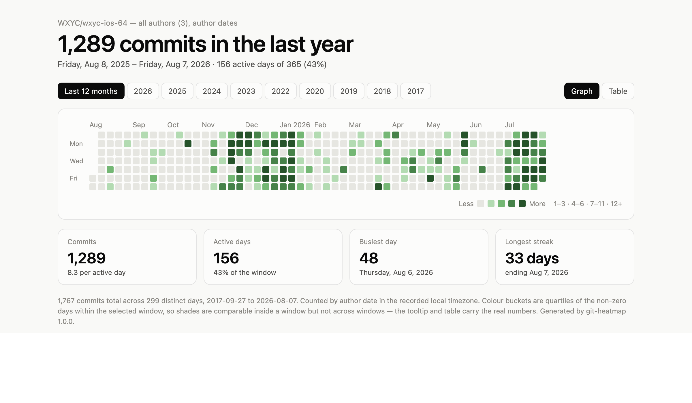

# git-heatmap

Render a GitHub-style commit-frequency calendar for any local git repository, as a single self-contained HTML file.

No network, no dependencies, no build step — one Python 3 file and the standard library. The generated page embeds its own data, so it works offline from `file://`, survives being emailed around, and needs no server.



## Install

```bash
./install.sh          # symlinks the script into ~/.local/bin
```

The symlink means edits in this repo take effect immediately, with no reinstall step. `~/.local/bin` must be on your `PATH`.

To install somewhere else, or to copy rather than symlink:

```bash
./install.sh --prefix /usr/local/bin --copy
```

Because the executable is named `git-heatmap` and lives on `PATH`, git exposes it as a subcommand automatically. Both forms work:

```bash
git heatmap        # git finds git-heatmap on PATH
git-heatmap        # or call it directly
```

## Usage

```bash
git heatmap                                   # this repo, opens in your browser
git heatmap ~/src/foo -o foo.html --no-open   # another repo, explicit output
git heatmap --author 'Jake' --no-merges       # one author, excluding merges
git heatmap --since 2024-01-01                # a slice of history
git heatmap --json                            # per-day counts on stdout, no HTML
```

### Options

| Flag | Meaning |
|---|---|
| `repo` | Repository path (positional, default `.`). Any subdirectory works. |
| `-o`, `--output` | Where to write the HTML. Default: a temp file. |
| `--no-open` | Don't open a browser. |
| `--json` | Print `{"YYYY-MM-DD": count}` to stdout and exit; no HTML. |
| `--author PATTERN` | Only commits by this author. Repeatable; git's regex rules apply. |
| `--branch REF` | Ref to walk (default `HEAD`). |
| `--all` | Walk every ref instead of `--branch`. |
| `--no-merges` | Exclude merge commits. |
| `--since`, `--until` | Passed through to `git log`. |
| `--date {author,committer}` | Which date to bucket by (default `author`). |
| `--path PATHSPEC...` | Only commits touching these paths. |
| `--title`, `--label` | Override the page title / repo label. |

### Exit codes

| Code | Meaning |
|---|---|
| 0 | Success |
| 1 | Usage or runtime error (not a repo, git missing, bad ref) |
| 2 | No commits matched the filters |

`2` is distinct from `1` so scripts can tell "nothing to show" apart from "something broke".

> **Gotcha:** `git heatmap --help` fails with *"No manual entry"* — git rewrites `--help` on any subcommand into a man-page lookup. Use `git heatmap -h` or `git-heatmap --help`.

## What the page shows

- **The calendar** — one cell per day, five shades, Sunday-start columns, exactly like GitHub's contribution graph.
- **A window selector** — rolling last-12-months plus one button per calendar year that actually has commits. Years with none are omitted.
- **Stat tiles** — commits, active days, busiest day, longest streak.
- **A table view** — every value reachable without relying on colour.
- **Light and dark themes** — each with its own green ramp, stepped for its own surface rather than flipped.

Hover or keyboard-focus any cell for its exact count.

## Reading it correctly

Two properties are worth knowing, because both can mislead:

**Shades are relative to the selected window.** The five buckets are quartiles of the non-zero days *inside whichever window you picked*. A dark cell in a quiet year and a dark cell in a busy year mean very different absolute numbers. Compare shades within a window, never across windows — the legend prints the current thresholds, and the tooltip and table carry real counts. GitHub's graph has this same property.

**Commits are counted by author date, in the timezone recorded in the commit.** Rebased or cherry-picked work lands on the day it was originally written, not the day it was replayed. Pass `--date committer` if you want the opposite. Author names respect `.mailmap`, so aliases collapse the way `git shortlog` shows them.

Neither is a bug to fix; they're the honest reading of git's data. They're stated on the page itself, in the footnote.

## Development

```bash
python3 -m unittest discover -s tests -v
```

25 tests, no dependencies. Fixture repositories are built programmatically with backdated commits, so no binary git data is committed.

The page's rendering logic (bucketing, month labels, streaks) lives in JavaScript inside the template and isn't covered by the Python tests. Changes there need a visual check — generate a page and look at it, including a calendar-year window and a repo dormant for over a year, which are the two cases that have broken before.

### Layout

```
git-heatmap          # the entire tool: CLI + embedded HTML template
install.sh           # symlink/copy onto PATH
tests/               # stdlib unittest, programmatic fixture repos
```

The HTML template is a module-level string at the bottom of `git-heatmap`, with `__DATA_JSON__`, `__META_JSON__`, and `__TITLE__` placeholders. It is substituted with `str.replace`, never `.format` or f-strings — the template is full of CSS and JS braces that would be misread as format fields.
